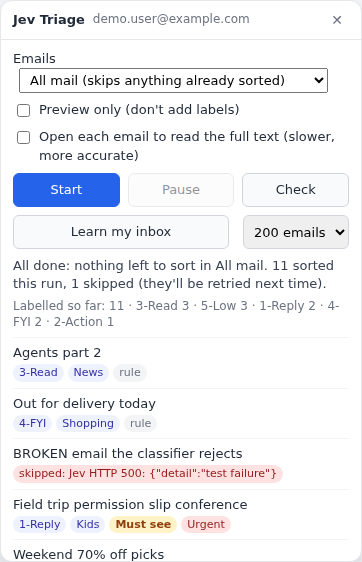
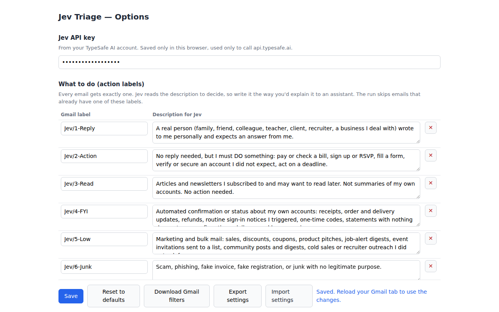
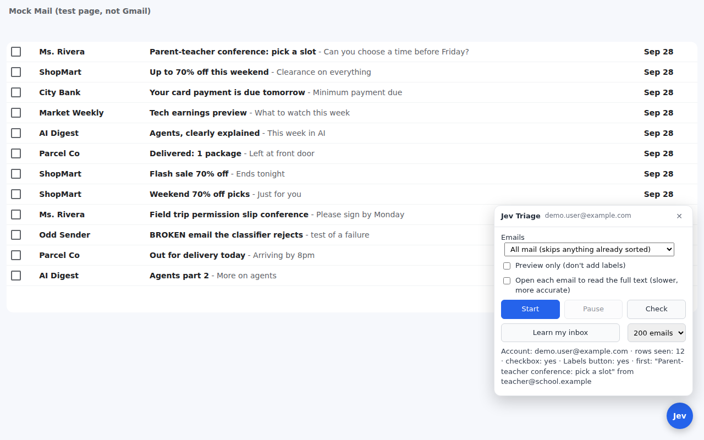
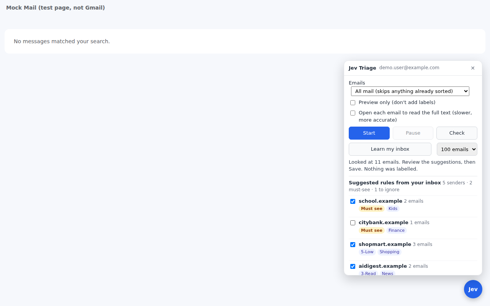
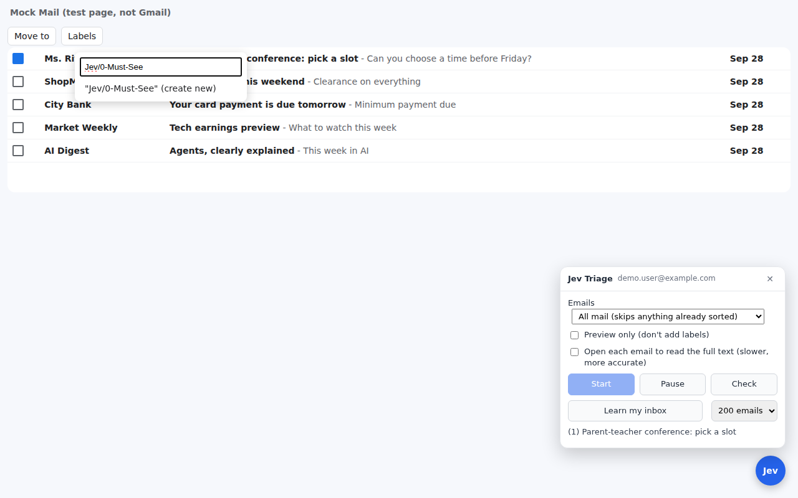
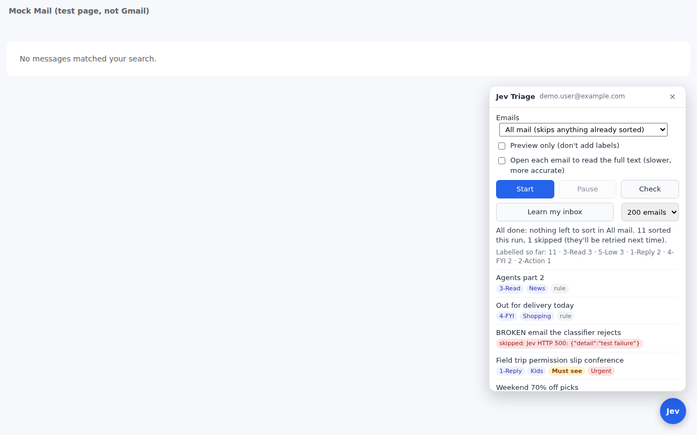

# Jev Triage for Gmail

A Chrome extension that sorts your Gmail **inside the tab you already have open**. It reads each email, asks [Jev](https://docs.typesafe.ai/api) (TypeSafe AI's decision model) what it is, and applies Gmail labels one email at a time. Ads and bulk mail can be moved out of the inbox, and the few emails that matter get a **Must See** label.

- No Google Cloud project, no Gmail API, no server. It works the Gmail page like you would.
- Bring your own Jev API key. Everything else stays in your browser.
- Labels only (plus optional archiving). It never deletes, sends or forwards anything.
- **Learn my inbox** builds sender rules from *your* mail, and **Download Gmail filters** turns them into filters Gmail runs on its own.

> Independent open-source project, inspired by [Jevmail](https://github.com/fazlerocks/jevmail). Not affiliated with Google or TypeSafe AI.



## What every email gets

| Kind | Labels |
|---|---|
| What to do (one) | `Jev/1-Reply` · `Jev/2-Action` · `Jev/3-Read` · `Jev/4-FYI` · `Jev/5-Low` · `Jev/6-Junk` |
| What it's about (one) | `Topic/Personal` · `Kids` · `Work` · `Career` · `Finance` · `Shopping` · `Security` · `News` · `Community` · `Health` · `Home` · `Other` |
| Flags (optional) | `Jev/0-Must-See` · `Jev/Urgent` · `Jev/Review` (Jev was unsure) |

Everything is editable in Options: rename labels, rewrite the description Jev reads, add your own categories and sender rules.

One Jev call answers four typed questions at once: **what to do**, **what it's about**, **how urgent**, and **did a real person write this to me**. Senders with a fixed rule skip Jev entirely.

## Install and first run

You need Chrome (or another Chromium browser), Gmail in English, and a Jev API key from your TypeSafe AI account.

### 1. Load the extension

1. Download this repository (green **Code** button → **Download ZIP**) and unzip it.
2. Open `chrome://extensions` and turn on **Developer mode** (top right).
3. Click **Load unpacked** and choose the **`extension`** folder.

### 2. Add your Jev key

Click the extension's icon → **Options**, paste your key, and click **Save**.



### 3. Open Gmail and click **Check**

A blue **Jev** button appears in the bottom-right corner of Gmail. Click it, then click **Check**. You should see your address, the rows it can see, and `checkbox: yes · Labels button: yes`.



### 4. Learn my inbox

Choose how many recent emails to look at and click **Learn my inbox**. Jev classifies them (nothing is labelled yet), and the panel suggests a rule for each sender that keeps sending the same kind of mail. Tick the ones you want and click **Save selected**.



### 5. Sort

Leave **All mail** selected and click **Start**. Keep the tab open (and visible, so Chrome doesn't slow it down).

- **Why the address bar changes:** Start opens a Gmail search for emails that don't have a `Jev/` action label yet (`-label:jev-1-reply -label:jev-2-action …`). That search is how it skips anything already sorted, by this extension or by your imported filters.
- **It keeps going on its own:** it works through the list, reloads it, waits if Gmail's search is a few seconds behind, and moves to later pages until nothing unsorted is left.
- **One bad email doesn't stop it:** if an email fails (Gmail hiccup, Jev error) it's skipped, shown in red in the panel, and retried on the next Start. It only stops if 5 in a row fail.
- **Pause and Start again any time:** it remembers what it already sorted and carries on.





### 6. Optional: let Gmail do it automatically

Click **Download Gmail filters**, then in Gmail go to ⚙ → **See all settings** → **Filters and Blocked Addresses** → **Import filters**. Choose the file, tick **Apply new filters to existing email**, and click **Create filters**. From then on Gmail applies your sender rules to new mail by itself, even with Chrome closed.

### 7. Optional: put Must See on top

Gmail ⚙ → **See all settings** → **Inbox** → Inbox type **Multiple inboxes**:

- Section 1: `label:jev-0-must-see` (name it **Must See**)
- Section 2: `label:jev-1-reply OR label:jev-2-action` (name it **To do**)
- Position: **Above the inbox**

## Settings you can share

**Options → Export settings** saves your categories and rules to a JSON file. **Import settings** loads one. API keys are never exported. Start from [`examples/jev-settings-example.json`](examples/jev-settings-example.json), a fictional setup that shows every kind of rule.

## How it works

```
Gmail tab (content.js + gmail-ui.js)         background.js                 api.typesafe.ai
  read row: sender, subject, preview  ──►  sender rule? use it        ──►  Jev: action, topic,
  tick it, Labels menu, Apply         ◄──  else ask Jev, add Must See  ◄──  urgency, is_personal
  action label last (it hides the row), Low/Junk via "Move to" (label + archive)
```

| File | Job |
|---|---|
| `extension/content.js` | The panel, the one-by-one loop, Learn my inbox |
| `extension/gmail-ui.js` | Reading rows and clicking Gmail's menus. **All Gmail selectors live in `SEL` at the top.** |
| `extension/background.js` | Calls Jev, applies sender rules, decides Must See |
| `extension/taxonomy.js` | Default categories, rule matching, Gmail filter export |
| `extension/options.*` | Settings editor, import/export |
| `test/mock-gmail.html` | A small stand-in for the Gmail page used by the tests |
| `test/e2e.mjs` | Loads the real extension in Chromium and runs Check → Learn → Start |

## Development

```bash
npm install
npx playwright install chromium
npm test             # unit checks + end-to-end run against the mock Gmail page
npm run screenshots  # same, and refreshes docs/images/
npm run zip          # extension zip for the Chrome Web Store
```

The end-to-end test never calls the real Jev API and never touches a real Gmail account: it serves the mock page at `mail.google.com` and answers Jev requests with a fake responder.

## Contributing

Contributions are very welcome. Good places to start:

- **Gmail changed and something broke?** Update `SEL` in `gmail-ui.js` and the matching part of `test/mock-gmail.html`.
- **Other Gmail languages.** The extension finds buttons by English names ("Labels", "Move to", "Create new").
- **Better Learn my inbox** suggestions, or an **undo** for a run.
- **New example settings** for common situations (student, freelancer, small business) in `examples/`.

See [CONTRIBUTING.md](CONTRIBUTING.md) for setup, coding style and how to send a pull request.

## Privacy and security

See [PRIVACY.md](PRIVACY.md) and [SECURITY.md](SECURITY.md). In short: email text goes only to the Jev API with your own key. Never paste API keys into issues, pull requests or settings files.

## License

[MIT](LICENSE)
